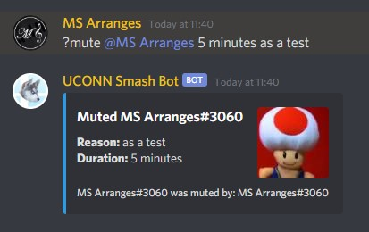
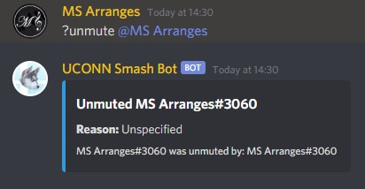
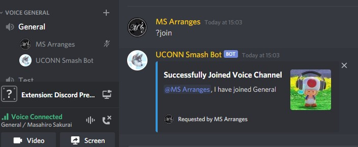
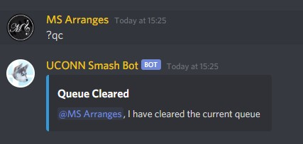
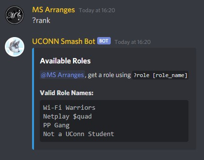
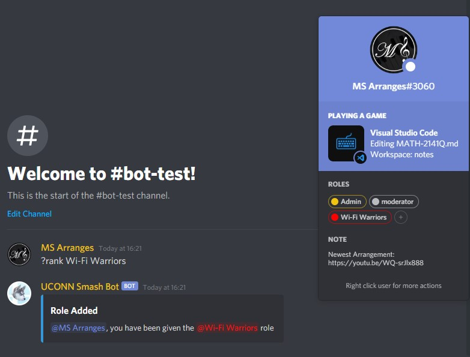

# Commands

Commands are sorted into **[cogs](#cogs)**, which are essentially groups of commands. The discord.py library uses cogs as a way of organising similar commands together so that the main script won't be a billion lines long.

Each command can be invoked using its name or aliases, which will be listed below. Some commands have convenient aliases that will save you some time.

Some commands will have subcommands, which are additional commands that are passed as the second argument to the command. This will make more sense as you read this page.

## Documentation Syntax

To simplify things, I've made a chart that tells you what exactly the argument syntax means

| Representation in Documentation | Meaning                                                                                                                                                                                 |
|:-------------------------------:|-----------------------------------------------------------------------------------------------------------------------------------------------------------------------------------------|
|               `?`               | Bot's static global prefix                                                                                                                                                              |
|         `command_name`          | The command's name. Most of the time, the `command_name` provided will be what is written into the code as the method's name. The `command_name` will always be postfixed to the prefix |
|          `sub_command`          | This command has subcommands                                                                                                                                                            |
|       `sub_command_args`        | Arguments for the subcommand                                                                                                                                                            |
|              `arg`              | An arbitrary argument of any datatype. The datatype will be specified if the `arg` requires data to be in a specific datatype                                                           |
|             `[arg]`             | The `arg` is necessary for command to function properly. You must provide whatever argument that is listed or else the command cannot be called                                         |
|             `(arg)`             | The `arg` is optional, and will still allow the command to function without it                                                                                                          |
|              `dt`               | A human readable date in a human readable format that will be parsed to extract a timestamp. When passing a `dt` , you pass it along with the argument it is attached to                |
|             `[dt]`              | The `dt` is required as a part of the `arg` , whether or not the `arg` is optional                                                                                                      |
|             `(dt)`              | The `dt` is an optional part of the `arg` , and will still allow the command to function without it                                                                                     |
|              `*va`              | Variable amount of consecutive `arg` can be passed, but at least one must be passed                                                                                                     |
|         `-arg_reliant`          | Specifies that the current `arg` cannot be passed if the argument `arg_reliant` is not passed                                                                                           |

# Cogs

|           Name            | Commands                                                                                                                                                                                      |
|:-------------------------:|-----------------------------------------------------------------------------------------------------------------------------------------------------------------------------------------------|
|    [Actions](#actions)    | [`actions`](#actions)                                                                                                                                                                         |
|       [Help](#help)       | [`help`](#help)                                                                                                                                                                               |
| [Moderation](#moderation) | [`chatclean`](#chatclean) [`mute`](#mute) [`unmute`](#unmute) [`kick`](#kick) [`ban`](#ban) [`unban`](#unban) [warn](#warn) [offense](#offense) [expunge](#expunge) [modsonline](#modsonline) |
|      [Music](#music)      | [join](#join) [play](#play) [queue](#queue) [queueclear](#queueclear) [stop](#stop) [leave](#leave) [volume](#volume) [playlist](#playlist)                                                   |
|      [Owner](#owner)      | [load](#load) [unload](#unload) [reload](#reload) [shutdown](#shutdown)                                                                                                                       |
|    [Pokédex](#pokédex)    | [pokedex](#pokédex)                                                                                                                                                                           |
|      [Roles](#roles)      | [reactionrole](#reaction-roles) [rank](#rank)                                                                                                                                                 |

## Actions

#### Usage

> `?actions (actions_name)`
> `?(actions_name) (@mention)`

#### Special Cases

* The top only displays the actions help menu, which you can acess help for each action
* The bottom actually does that action to `@mention` , or makes you do the action if `@mention` is not explicitly specified

## Help

#### Usage

> `?help (command_name)`

#### Aliases

 `h`

#### Special Cases

* If `command_name` is not explicitly specified, it defaults to showing all commands the bot currently supports

## Moderation

### Chatclean

#### Usage

> `?chatclean (amount) (@mention)-amount`

#### Aliases

`clear`  `clean`  `chatclear`  `cleanchat`  `clearchat`  `purge`

#### Examples

#### Permissions

|       User        |        Bot        |
|:-----------------:|:-----------------:|
| `Manage Messages` | `Manage Messages` |

#### Special Cases

* `amount` defaults to 1
    - This argument represents the number of messages to be processed. There will be some cases where this does not equal the number of deleted messages
    - The bot is not allowed to delete messages older than 2 weeks. This is a built in Discord API restriction
* If `@mention` is specified, it will delete messages only from that user

### Mute

#### Usage

> `?mute [@mention]*va (reason)(dt)`

#### Aliases

`silence`  `stfu`  `shut`  `shush`  `shh`  `shhh`  `shhhh`  `quiet`

#### Examples

#### Permissions

|      User      |      Bot       |
|:--------------:|:--------------:|
| `Manage Roles` | `Manage Roles` |

#### Special Cases

* You cannot mute an already muted person
    - *This is determined by if the user has the "Muted" role, which is automatically generated by the bot*
* `reason` defaults to "Unspecified" if not explicitly provided

### Unmute

#### Usage

> `?unmute [@mention]*va (reason)(dt)`

#### Aliases

`unsilence`  `unstfu`  `unshut`  `unshush`  `unshh`  `unshhh`  `unshhhh`  `unquiet`

#### Examples

#### Permissions

|      User      |      Bot       |
|:--------------:|:--------------:|
| `Manage Roles` | `Manage Roles` |

#### Special Cases

* You cannot unmute an already unmuted person
    - *This is determined by if the user has the "Muted" role, which is automatically generated by the bot*
* `reason` defaults to "Unspecified" if not explicitly provided

### Kick

#### Usage

> `?kick [@mention]*va (reason)`

#### Examples

#### Permissions

|      User      |      Bot       |
|:--------------:|:--------------:|
| `Kick Members` | `Kick Members` |

#### Special Cases

* `reason` defaults to "Unspecified" if not explicitly provided

### Ban

#### Usage

> `?ban [@mention]*va (msg_del_days) (reason)`

#### Examples

#### Permissions

|     User      |      Bot      |
|:-------------:|:-------------:|
| `Ban Members` | `Ban Members` |

#### Special Cases

* `msg_del_days` will delete the user's messages from the past `msg_del_days` days

    - `msg_del_days` defaults to 0 if not explicitly provided

* `reason` defaults to "Unspecified" if not explicitly provided

### Unban

#### Usage

> `?unban [user]*va`

#### Examples

#### Permissions

|     User      |      Bot      |
|:-------------:|:-------------:|
| `Ban Members` | `Ban Members` |

#### Special Cases

* `user` can be one of the following (in order of reliability)
    - User ID
    - User mention
    - User name#discriminator
    - User name

### Warn

#### Usage

> `?warn [@mention]*va (reason)`

#### Examples

* The bottom picture is what the `@mention` would receive in their DMs upon warn, just without the topmost line

#### Permissions

|     User      |      Bot      |
|:-------------:|:-------------:|
| `Ban Members` | `Ban Members` |

#### Consequence Structure

> 1st Warn - Nothing
> 2nd Warn - Mute for 10 minutes
> 3rd Warn - Kicked from the server
> 4th Warn - Banned from the server

### Offense

#### Usage

> `?offense (@mention)`

#### Aliases

 `offenses`

#### Examples

#### Special Cases

* This command searches for all warnings that you have given. If you haven't given that user any warnings, offense will return nothing, even if that user has warnings from other moderators

### Expunge

#### Usage

> `?expunge [@mention]`

#### Permissions

|     User      |      Bot      |
|:-------------:|:-------------:|
| `Ban Members` | `Ban Members` |

#### Interactive Panel

Instructions on how to expunge warn records will be given on an interactive panel

### ModsOnline

#### Usage

> `?modsonline`

#### Aliases

`mod`  `mods`  `mo`

#### Examples

#### Special Cases

* This command searches for a role that contains the substring "moderator" (case insensitive)
* Will only detect statuses `Online` , `Away` , and `DND`
* Will not count any bots

## Music

### Join

#### Usage

> `?join`

#### Examples

#### Special Cases

* This command will move the bot from its current connected channel to the one you are currently connected in if you execute this command while in a different voice channel as the bot

### Play

#### Usage

> `?play (query_URL)`

#### Examples

#### Control Panel

> ⏪ - play previous song in queue
>  
> ⏯️ - play/pause current song
>  
> ⏩ - play next song in queue
>  
> ⏹️ - stop playing all songs and clear queue

#### Special Cases

* `query_URL` can be the following types
    - YouTube Video URL
    - YouTube Playlist URL
    - YouTube Livestream URL
    - A search term
* **ONLY IF** a song is loaded in queue, then you can execute play without specifying `query_URL`

### Queue

#### Usage

> `?queue (query_URL)`

#### Examples

#### Special Cases

* `query_URL` can be the following types
    - YouTube Video URL
    - YouTube Playlist URL
    - YouTube Livestream URL
    - A search term
    - Nothing
* If `query_URL` is not explicitly specified, it will display the current queue
* You must be in the same voice channel as the bot to use this command

### QueueClear

#### Usage

> `?queueclear`

#### Aliases

`clearqueue`  `qc`

#### Examples

#### Special Cases

* You must be in the same voice channel as the bot to use this command
* Nothing will be cleared if there is nothing queued

### Stop

#### Usage

> `?stop`

#### Special Cases

* Only the server owner is authorised to use this command
* You must be in the same voice channel as the bot to use this command
* For ordinary users, click the stop icon on the play control panel. See [control panel](#control-panel) for more details

### Leave

#### Usage

> `?leave`

#### Examples

#### Special Cases

* You must be in the same voice channel as the bot to use this command

### Volume

#### Usage

> `?volume [amount]`

#### Examples

#### Special Cases

* `amount` must be an integer between 1 - 100, otherwise it will display the current volume

### Playlist

#### Usage

> `?playlist (sub_command) (sub_command_args)`

#### Aliases

 `playlists`

#### Loading Saved Playlist

> `?playlist load [playlist_name]`

#### Saving A Playlist From Queue

> `?playlist save`

##### Aliases

 `edit`

#### Adding Tracks to Saved Playlist

> `?playlist add`

#### Removing Saved Playlist

> `?playlist remove`

##### Aliases

 `delete`

#### Interactive Panel

The playlist commands use interactive panels to allow for easy user input of values required for the commands to work

## Owner

*Only the bot owner can use these commands*

### Load

#### Usage

> `?load [extension]`

#### Aliases

`l`  `ld`

### Unload

#### Usage

> `?unload [extension]`

#### Aliases

`ul`  `uld`

### Reload

#### Usage

> `?reload`

#### Aliases

`r`  `rl`

### Shutdown

#### Usage

> `?shutdown`

#### Aliases

 `taskkill`

## Pokédex

#### Usage

> `?pokedex (option)`

#### Aliases

 `dex`

#### Special Cases

* This only returns the help command for `option` if specified
* If `option` is not explicitly specified, it returns the help panel that details all pokédex commands

## Roles

### Reaction Roles

#### Usage

> `?reactionrole (sub_command)`

#### Aliases

 `rr`

#### Creating a Reaction Roles Panel

> `?reactionrole create`

##### Aliases

`-c`  `start`  `make`

#### Editing a Reaction Roles Panel

> `?reactionrole edit`

##### Aliases

`-e`  `adjust`

#### Deleting a Reaction Roles Panel

> `?reactionrole delete`

#### Aliases

`-d`  `-rm`  `del`

#### Reaction Roles Setup Panel

Executing any reaction roles command will automatically start a setup panel that will guide you through inputting the required information for that command

### Rank

#### Usage

> `?rank (role_name)`

#### Examples

#### Special Cases

* If `role_name` is not specified, it will return an embed with all the possible `role_name` arguments
* `role_name` is case sensitive
* Doing this command when you already have the role will remove the role from you
